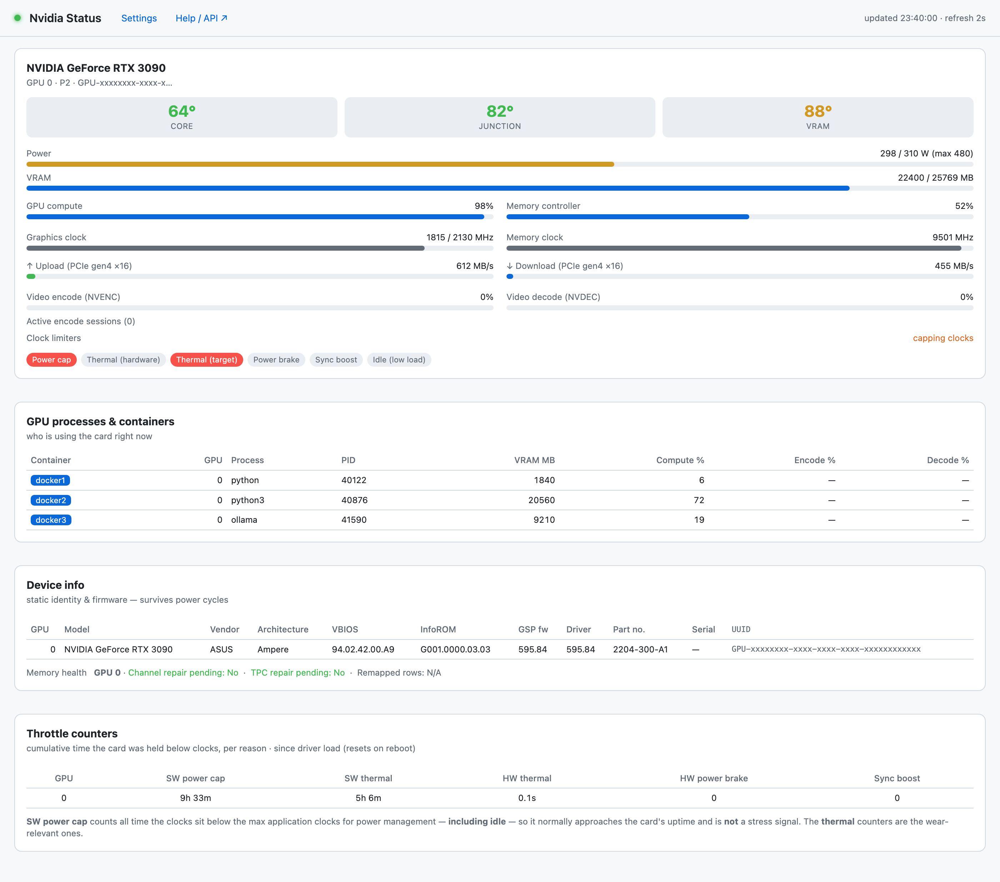

# Nvidia Status

**NVIDIA GPU dashboard + exporter** — shows the GDDR6 / GDDR6X VRAM & junction
temps that `nvidia-smi` hides on consumer RTX 30/40 cards (read straight off the
GPU's PCIe BAR0), plus detailed stats including **per‑Docker‑container** GPU usage.

Exports to **Prometheus, a JSON API, MQTT (with Home Assistant auto‑discovery) and
InfluxDB (v1/v2)** out of the box — one small container for live viewing *and*
long‑term analysis in Grafana.

> Built for Unraid, works on any Linux host with the NVIDIA proprietary driver.

---



## Why?

`nvidia-smi` cannot report **memory‑junction temperature** on consumer GeForce cards — yet
that's the number that actually throttles a 3090/4090 (GDDR6X junctions run 20–30 °C hotter
than the core and throttle around 95–110 °C). Nvidia Status reads it directly from the
memory‑controller registers, alongside everything `nvidia-smi` *does* expose, and presents
it all in one place — plus which **Docker container** is using the GPU and what **codec**
it's encoding.

## Features

- **Hidden temps:** core **+ junction + VRAM** (via BAR0) + all thresholds
- **Power:** draw, limit, min/max/default, and optional **per‑GPU power‑limit control** with a
  latch that re‑applies after a restart
- **Clocks / utilisation / VRAM / fan / PCIe** gen & width **+ live upload/download bandwidth**
- **Throttle reasons** (power cap, thermal, power brake, …) as clear indicators
- **Per‑process → container:** each GPU process' VRAM / compute / encode / decode, mapped to
  the **owning Docker container**
- **NVENC sessions:** codec (H.264 / HEVC / AV1), resolution, fps — per session, per container
- **Multi‑GPU aware** throughout (per‑GPU cards, metrics, MQTT devices, InfluxDB rows, control)
- **Five outputs:** dashboard, Prometheus, JSON, MQTT/HA, InfluxDB — enable/disable each
- **Built‑in Settings page** — configure MQTT/InfluxDB and toggle features from the browser

## GPU support

Everything **except** junction/VRAM temps works on any GPU the NVIDIA Linux driver supports.
The BAR0 junction/VRAM read is architecture‑specific:

| Support | Cards |
|---|---|
| ✅ Tested | RTX 3090, 4060 Ti 16GB, 4060 |
| ✅ Expected | RTX 4090 / 4080 / 4070 series, 3080 variants, pro A‑series, L40S, A10 |
| 🟠 Partial | Blackwell / RTX 50 (core + hotspot only) |
| ❌ Unsupported | RTX 3070 / 3070 LHR; pre‑Ampere (RTX 20, GTX 16/10) |

On unsupported cards junction/VRAM simply show blank — **everything else still works**.

## Install (Unraid)

1. Install the **Nvidia‑Driver** plugin (Community Applications) if you haven't.
2. Search Community Applications for **Nvidia Status** and install, or add this repo's template.
3. Open the WebUI. Configure MQTT/InfluxDB from the **Settings** page if you want them.

### docker run

```bash
docker run -d --name nvidia-status \
  --runtime=nvidia -e NVIDIA_VISIBLE_DEVICES=all -e NVIDIA_DRIVER_CAPABILITIES=all \
  --cap-add SYS_RAWIO --device /dev/mem \
  --pid=host --cgroupns=host \
  -v /var/lib/docker/containers:/hostcontainers:ro \
  -v /mnt/user/appdata/nvidia-status:/config \
  -p 9835:9835 --restart unless-stopped \
  edddeduck/nvidia-status:latest
```

Add `-e ENABLE_POWER_LIMIT=1 --privileged` to enable power‑limit control.

## Endpoints

| Path | What |
|---|---|
| `/` | Live dashboard |
| `/settings` | Configure MQTT / InfluxDB / toggles / power control |
| `/metrics` | Prometheus |
| `/json` | Full JSON snapshot |
| `/help` | Full field/metric/topic reference |

## Integrations

Configure from the **Settings** page or via env vars.

- **Prometheus / Grafana / Netdata / Telegraf** → scrape `/metrics`
- **Home Assistant** → set `MQTT_HOST` (+ user/pass); sensors auto‑appear via MQTT discovery,
  grouped as one device per GPU — **including the hidden junction temp**
- **InfluxDB → Grafana** → set `INFLUX_URL` (+ v1 `INFLUX_DB` or v2 `INFLUX_TOKEN`); writes
  line protocol directly, no Telegraf needed
- **Homepage / Dashy / Node‑RED** → read `/json`

## Configuration

Everything has an env var (see the Unraid template / `nvidia-status.xml`), and can also be set
on the **Settings** page (persisted to `/config/settings.json`, which overrides env vars).
Key ones: `NODE_NAME`, `INTERVAL`, `ENABLE_DASHBOARD/METRICS/JSON/MQTT/INFLUX`,
`MQTT_HOST/PORT/USER/PASS`, `INFLUX_URL/DB/USER/PASS` (or v2 `INFLUX_TOKEN/ORG/BUCKET`),
`ENABLE_POWER_LIMIT`, `PL_MIN/PL_MAX`.

## Security

- Reads the GPU's **BAR0** via `SYS_RAWIO` + `/dev/mem` — required to read the junction/VRAM
  temps that Nvidia doesn't expose. This grants the container raw physical‑memory read.
- Per‑process → container names need `--pid=host` + `--cgroupns=host` + the read‑only
  `/var/lib/docker/containers` mount.
- **Power‑limit control** additionally requires `--privileged` and is **off by default**.
- Secrets you enter (MQTT/InfluxDB passwords) are stored in the container's `/config` volume.

## Credits

- VRAM‑junction/hotspot reader: [`gputemps`](https://github.com/ThomasBaruzier/gddr6-core-junction-vram-temps)
  by **ThomasBaruzier** (Apache‑2.0) — vendored as `gputemps.c`, see `GPUTEMPS-LICENSE`.

## License

MIT — see [LICENSE](LICENSE). The vendored `gputemps.c` retains its Apache‑2.0 license.
